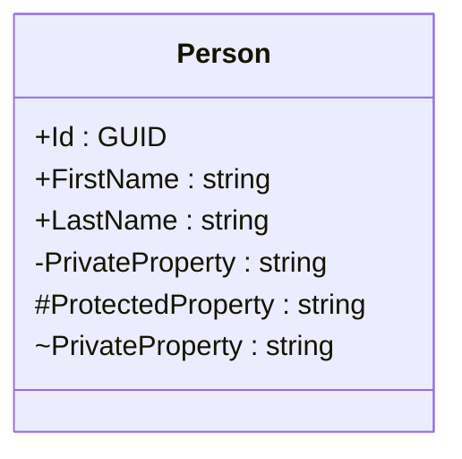
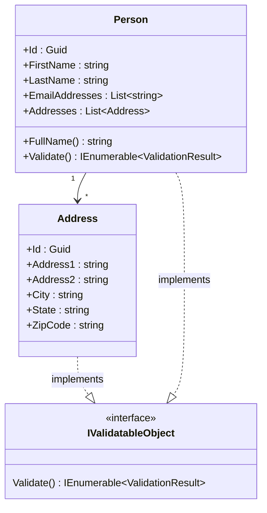

## Class Diagrams

Version 1:

```mermaid
classDiagram
     class Person {
        +Id : GUID
        +FirstName : string
        +LastName : string
        -PrivateProperty : string
        #ProtectedProperty : string
        ~PrivateProperty : string
    }
```
Version 2:

```mermaid
classDiagram
    class IValidatableObject {
        <<interface>>
        Validate() IEnumerable~ValidationResult~
    }
    class Address {
        +Id : Guid
        +Address1 : string
        +Address2 : string
        +City : string
        +State : string
        +ZipCode : string
    }
    Address ..|> IValidatableObject : implements
    class Person {
        +Id : Guid
        +FirstName : string
        +LastName : string
        +EmailAddresses : List~string~
        +Addresses : List~Address~
        +FullName() string
        +Validate() IEnumerable~ValidationResult~
    }
    Person ..|> IValidatableObject : implements
    Person "1" --> "*" Address
```