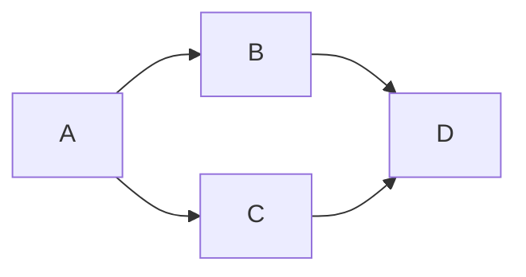
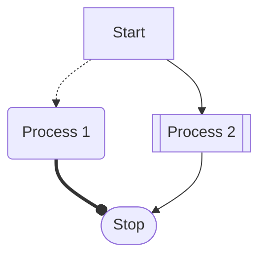

## Flowcharts

```mermaid

graph LR
    A --> B
    A --> C
    B --> D
    C --> D
```

```mermaid
graph TB
    A[Start] -.-> B(Process 1)
    A --> C[[Process 2]]
    B ==o D([Stop])
    C --> D
```
