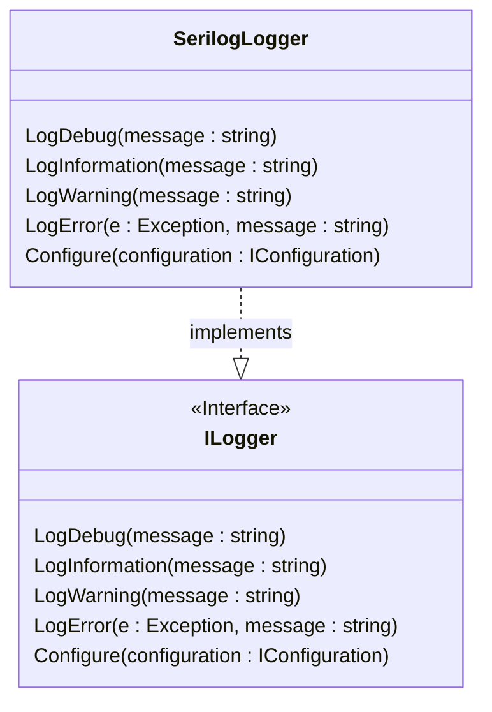

## Object-oriented Vocabulary

In addition to the pillars and principles, there are other other terms:
- Cohesion - how closely related the code is in a particular module - or grouping of code. 
- Coupling - is a measure of how much one class or object is dependent on another.
- Orthogonality - 

### Cohesion
This could be a single method, a class, a namespace or even an entire project or solution. Whatever scale you're looking at, cohesion refers to how well the elements at that level are focused on the single concept.

### Coupling
Classes that leverage other classes become logically coupled to them. The more ties you have between them, the stronger that coupling becomes. The problem is that changes to the dependencies can bubble up and require changes in the consumers. The more of these connections a module has, the more vulnerable it becomes to these ripple effects. Coupling is referred to as being tight, lots of connections, or loose, few connections. Tightly coupled code is more brittle, loosely coupled code is more flexible.

The [Person](ClassDiagrams.md) is tightly coupled to the [Address](ClassDiagrams.md) but that is fine for now. It is when we have multiple types of Address that we may need an Address interface, but for now we don't.